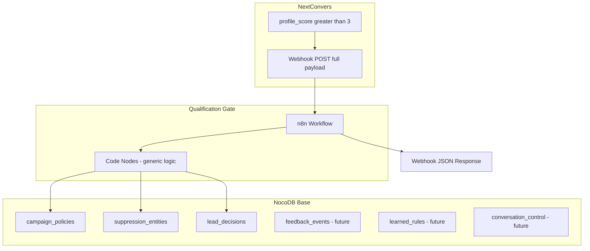

# Architecture — NextConvers Qualification Gate

## Overview

The Qualification Gate is an **external, reusable service** that sits between NextConvers lead scoring and downstream actions (CRM sync, human review, LinkedIn automation). It receives full lead payloads via webhook, applies config-driven qualification rules, persists audit-friendly decisions, and returns a structured JSON response.

**It does not modify the NextConvers core product.**

## Components

## Design principles

### 1. Config-driven, not code-driven

All client-specific ICP logic lives in NocoDB `campaign_policies` and `suppression_entities`. The n8n workflow and JavaScript code nodes contain **zero** hardcoded client names, roles, industries, or keywords.

### 2. Separation from NextConvers core

This project is a standalone repository at `/opt/apps/nextconvers-qualification-gate`. NextConvers only needs to POST to the webhook URL when `profile_score > 3`.

### 3. Audit-first

Every decision is stored in `lead_decisions` with:
- Normalized lead fields
- Qualification status and confidence
- Decision, reject, and review reasons
- Suppression matches, risk flags, positive signals
- Full `raw_payload` for forensic review

### 4. Idempotent processing

Re-sending the same lead (same `source_row_id` + `campaign_name`) updates the existing `lead_decisions` row instead of creating duplicates.

## Data flow

1. **Intake** — Webhook receives NextConvers payload
2. **Normalize** — Stable field mapping + safe JSON parsing
3. **Policy load** — Exact campaign policy, fallback to `__default__`
4. **Suppression check** — Account + campaign suppressions
5. **Hard rules** — Score, geography, industry, role, keyword, company type
6. **Decision** — Single status: `READY_FOR_CRM`, `READY_FOR_REVIEW`, `REJECTED`, `SUPPRESSED`
7. **Persist** — Upsert `lead_decisions`
8. **Respond** — JSON webhook response to NextConvers

## MVP boundaries

| Included | Excluded |
|----------|----------|
| Webhook intake | CRM automatic sync |
| Config-driven hard rules | AI qualification |
| Suppression matching | Unipile / LinkedIn messaging |
| Decision logging | Skylead automation |
| Review-ready output | `learned_rules` usage |
| | `conversation_control` usage |
| | `feedback_events` workflow integration |

## Extension points (future)

### CRM sync
- Read `lead_decisions` where `qualification_status = READY_FOR_CRM` and `crm_sync_status = pending`
- New n8n workflow or branch; no changes to qualification logic

### AI qualification
- Add AI node between hard rules and decision for ambiguous `READY_FOR_REVIEW` leads
- Store AI reasoning in `lead_decisions`; optionally write to `learned_rules`

### Unipile conversation automation
- Use `conversation_control` table for per-profile automation locks
- Trigger only after CRM sync and human approval

### Feedback loop
- Human actions in NocoDB UI write to `feedback_events`
- Batch job promotes patterns to `learned_rules` or updates `suppression_entities`

## File layout

| Path | Role |
|------|------|
| `n8n/workflows/qualification-gate-mvp.json` | Importable orchestration |
| `n8n/code-nodes/*.js` | Source-of-truth logic (inlined in workflow) |
| `config/qualification-policy.schema.json` | Policy validation schema |
| `config/examples/*.json` | Example seed policies |
| `nocodb/tables.md` | Table definitions |
| `nocodb/seed-data.md` | Example Telefónica seed instructions |

## Security notes

- NocoDB API token stored only in n8n `config1` node (not in repo)
- `raw_payload` may contain PII — restrict NocoDB base access
- Webhook URL should use HTTPS; consider n8n webhook authentication for production
