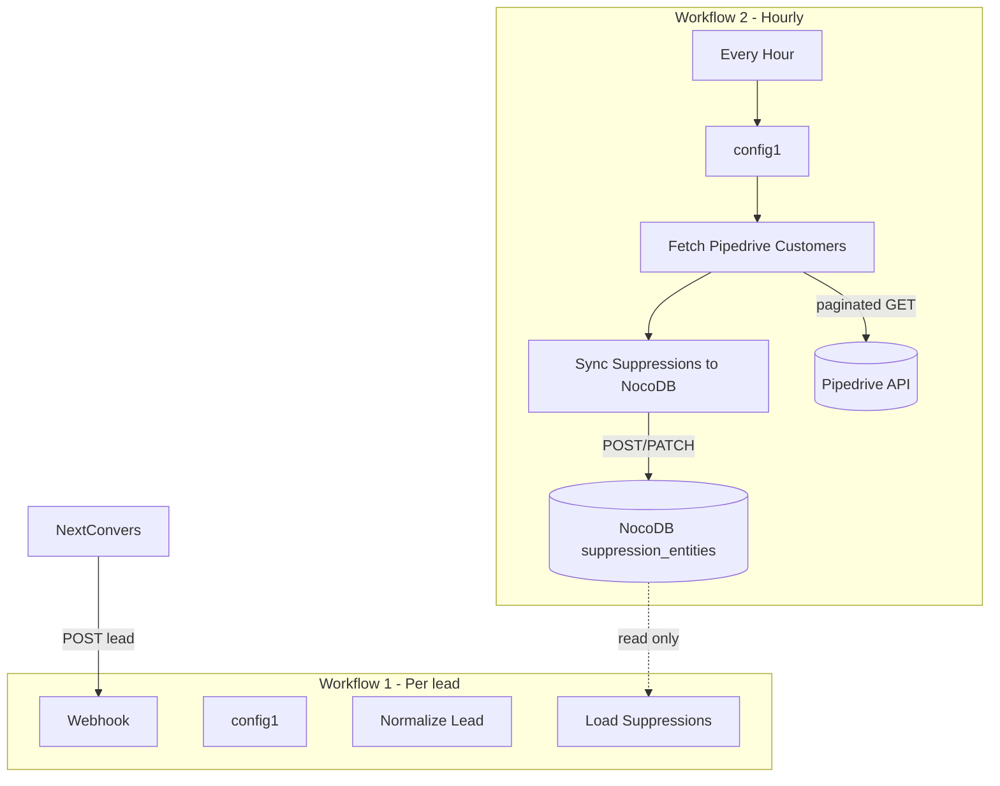

# Blueprint — Pipedrive Customers → Suppression Sync

**Workflow name in n8n:** `Pipedrive Customers → Suppression Sync`  
**Import file:** [`n8n/workflows/pipedrive-suppression-sync.json`](../n8n/workflows/pipedrive-suppression-sync.json)  
**Runs:** Scheduled (hourly) — **not** on every lead  
**Calls Pipedrive:** Yes (~32 paginated requests for 16k orgs, or fewer with filter)  
**Calls NocoDB:** Yes (read existing + write updates)

---

## How it fits with Qualification Gate



**Workflow 1** (`qualification-gate-mvp.json`) never touches Pipedrive.  
**Workflow 2** (`pipedrive-suppression-sync.json`) never receives webhooks.

---

## Node pipeline (5 nodes + sticky note)

```
Daily Schedule
  → config1
  → Fetch Pipedrive Customers
  → Sync Suppressions to NocoDB
  → More Pipedrive Pages? ──(if not complete)──► back to Fetch
```

| # | Node | Type | Calls |
|---|------|------|-------|
| 1 | Daily Schedule | Schedule Trigger | — |
| 2 | config1 | Set | — |
| 3 | Fetch Pipedrive Customers | Code | Pipedrive (4 pages max per iteration) |
| 4 | Sync Suppressions to NocoDB | Code | NocoDB bulk POST |
| 5 | More Pipedrive Pages? | IF | Loops until `fetch_complete` |

### n8n Cloud 60 second Code node limit

Each Code node must finish within **~60 seconds**. The workflow loops in small batches instead of processing all 16k orgs in one node.

Set workflow **Execution timeout** to 3600s (1 hour) in n8n settings so the loop can complete.

---

## Node 1 — Every Hour

| Setting | Value |
|---------|-------|
| Type | Schedule Trigger |
| Interval | Every 1 hour (changeable) |
| Execution timeout | 3600 s (set in workflow settings) |

**Manual test:** open workflow → **Execute workflow** (does not need Listen mode).

---

## Node 2 — config1

Edit **only this node**. All secrets and tuning live here.

### Pipedrive

| Variable | Example | Purpose |
|----------|---------|---------|
| `pipedrive_api_base` | `https://api.pipedrive.com/v1` | API base URL |
| `pipedrive_api_token` | *(secret)* | API token |
| `pipedrive_api_version` | `v1` | `v1` (recommended) or `v2` |
| `pipedrive_customer_mode` | `label_ids` | `label_ids` or `all_organizations` |
| `pipedrive_customer_label_ids` | `41,42` | Broker + Cliente Final |
| `pipedrive_filter_id` | *(empty or ID)* | **Recommended at 16k orgs** — Pipedrive saved filter |
| `pipedrive_domain_field_key` | `website` | Field for domain extraction |
| `pipedrive_page_size` | `500` | Orgs per Pipedrive page |
| `pipedrive_max_pages_per_run` | `4` | Pages per Code node run (n8n Cloud 60s limit) |
| `pipedrive_max_loop_iterations` | `20` | Safety cap on loop iterations per execution |
| `code_time_budget_ms` | `45000` | Stop each Code node before 60s timeout |

### NocoDB

| Variable | Example | Purpose |
|----------|---------|---------|
| `qg_account_id` | `rq1lQcYTToC9hlWD4vO94g` | NextConvers account ID |
| `nocodb_base_url` | `https://mpa.parvusmedia.com` | NocoDB URL |
| `nocodb_api_token` | *(secret)* | API token |
| `nocodb_suppression_entities_table_id` | `m29pd9rqgfm3agu` | Target table |
| `nocodb_bulk_insert_size` | `100` | Rows per bulk POST |
| `sync_max_bulk_ops_per_run` | `15` | Max bulk POSTs per sync iteration |
| `sync_existing_load_max_pages` | `3` | Existing rows loaded per iteration for dedup |
| `sync_enable_deactivate` | `false` | Deactivate stale rows (enable after first full sync) |

### Pipedrive labels (your account)

| ID | Label |
|----|-------|
| `41` | Broker |
| `42` | Cliente Final |

---

## Node 3 — Fetch Pipedrive Customers

| Setting | Value |
|---------|-------|
| Type | Code |
| Source file | `n8n/code-nodes/pipedrive-fetch-customers.js` |

### What it does

1. Downloads organizations from Pipedrive in pages of 500 ( **not** one call per company).
2. If `pipedrive_filter_id` is set → uses Pipedrive filter (fewer pages).
3. Else filters by label IDs `41,42`.
4. Builds `desired_rows[]` for NocoDB:

| entity_type | match_type | reason |
|-------------|------------|--------|
| `company_name` | `normalized_name` | `existing_customer` |
| `company_domain` | `domain` | `existing_customer` |

### Output example

```json
{
  "desired_rows": [ "...array of suppression rows..." ],
  "pipedrive_fetched_count": 16000,
  "pipedrive_customer_count": 8200,
  "pipedrive_pages_fetched": 32,
  "suppression_row_count": 12000
}
```

---

## Node 4 — Sync Suppressions to NocoDB

| Setting | Value |
|---------|-------|
| Type | Code |
| Source file | `n8n/code-nodes/pipedrive-sync-suppressions.js` |

### What it does

1. **Reads** existing `existing_customer` rows from NocoDB (paginated, inside this node).
2. **Creates** new rows from Pipedrive.
3. **Reactivates** rows that exist but were inactive.
4. **Deactivates** sync-managed rows no longer in Pipedrive.
5. **Never touches** manual rows with `match_type=contains` (e.g. Movistar, Telefónica).

### Output example

```json
{
  "created": 120,
  "reactivated": 5,
  "unchanged": 4800,
  "deactivated": 12,
  "write_limit_reached": false,
  "writes_performed": 137,
  "errors": []
}
```

---

## Import checklist

| Step | Action |
|------|--------|
| 1 | n8n → **Workflows** → **Import from File** |
| 2 | Select `n8n/workflows/pipedrive-suppression-sync.json` |
| 3 | Run `node scripts/apply-deployment-secrets.js` **or** paste tokens in `config1` |
| 4 | Set `pipedrive_customer_label_ids` = `41,42` |
| 5 | *(Recommended)* Create Pipedrive filter for Broker + Cliente Final → set `pipedrive_filter_id` |
| 6 | **Activate** workflow |
| 7 | **Execute workflow** once manually and check node 4 output |
| 8 | Verify new rows in NocoDB `suppression_entities` |

---

## API call budget (16k organizations)

| Phase | Calls | Notes |
|-------|-------|-------|
| Pipedrive download | ~32 | 500 orgs/page; **not** 16k calls |
| With `pipedrive_filter_id` | 2–10 | Only customer orgs |
| NocoDB writes (current) | up to 2× customers | 1 POST/PATCH per row; throttled |
| NocoDB reads | 1–50 pages | Inside sync node |

---

## Troubleshooting

| Symptom | Fix |
|---------|-----|
| `pipedrive_customer_label_ids is empty` | Set `41,42` in config1 |
| `write_limit_reached: true` | Normal at scale; loop continues in same execution |
| Task execution timed out after 60 seconds | Re-import latest workflow; uses batched loop + bulk insert |
| 0 customers | Check label IDs or set `pipedrive_filter_id` |
| Manual exclusions changed | Rows with `contains` are not managed by this workflow |

---

## Related docs

- [Qualification Gate workflow](n8n-workflow.md) — Workflow 1 (webhook)
- [Scale architecture](scale-architecture.md) — volumes and future snapshot design
