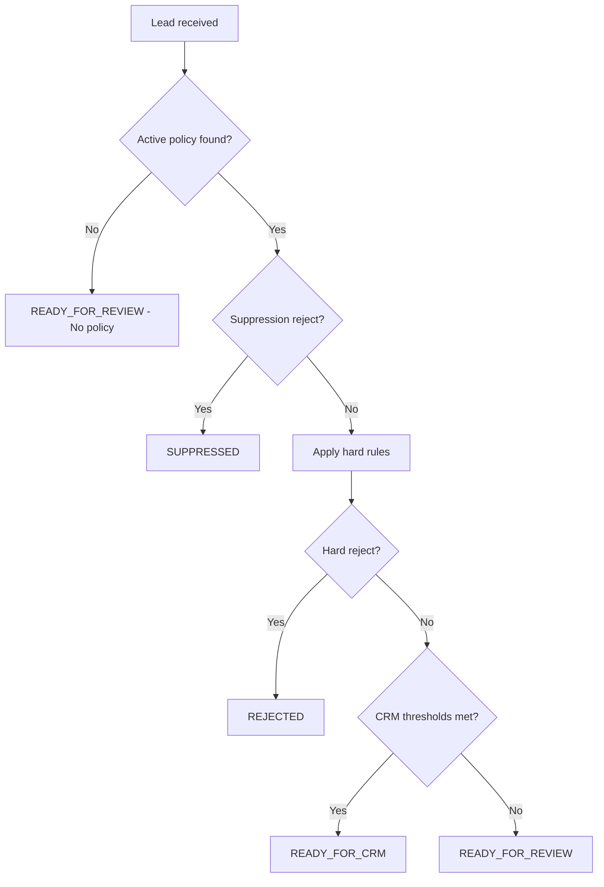

# Qualification Logic

All rules are driven by `campaign_policies` and `suppression_entities` records. This document describes the evaluation order and field semantics.

## Decision outcomes

| Status | When |
|--------|------|
| `SUPPRESSED` | Critical suppression match (`severity = reject`) |
| `REJECTED` | Hard reject rule fired (score, geography, excluded role/industry/keyword/company type) |
| `READY_FOR_CRM` | Passes all gates; scores and positive signals meet CRM thresholds |
| `READY_FOR_REVIEW` | Ambiguous, missing policy, review triggers, or insufficient positive signals |

Priority: **SUPPRESSED** > **REJECTED** > **READY_FOR_CRM** > **READY_FOR_REVIEW**

## Evaluation order



### 1. Policy resolution

Lookup order:
1. `account_id` + exact `campaign_name` + `active = true`
2. `account_id` + `campaign_name = __default__` + `active = true`
3. If neither found → `READY_FOR_REVIEW`, reason: `No active policy found`

### 2. Suppression check

Load active `suppression_entities` for `account_id` where:
- `campaign_name` is empty (global), OR
- `campaign_name` matches lead's campaign

**Match types:**

| match_type | Behavior |
|------------|----------|
| `exact` | Case-insensitive equality |
| `contains` | Haystack contains needle |
| `domain` | Email/URL domain equality |
| `linkedin_url` | Normalized LinkedIn URL equality |
| `normalized_name` | Punctuation-stripped name equality |

**Severity:**
- `reject` → immediate `SUPPRESSED`, stop evaluation
- `review` → add risk flag, continue evaluation

### 3. Hard rules (from campaign_policies)

#### Score gates

| Rule | Default action |
|------|----------------|
| `profile_score < min_profile_score` | REJECTED |
| `company_score < min_company_score` | REJECTED, or REVIEW if `review_if_profile_score_high_company_score_low` and profile is high |
| High profile + low company (when flag enabled) | REVIEW |

#### Company size

| Rule | Action |
|------|--------|
| `employee_count < min_company_size` | REJECTED |
| `employee_count > max_company_size` (when set) | REVIEW |

#### Geography

| Rule | Action |
|------|--------|
| Country in `excluded_countries` | REJECTED |
| Country not in `allowed_countries` (when list non-empty) | REVIEW |

#### Industry

| Rule | Action |
|------|--------|
| Industry matches `excluded_industries` | REJECTED |
| Industry not in `allowed_industries` (when list non-empty) | REVIEW |

#### Roles and keywords

Evaluated against `headline` + `current_position` (roles) and headline + position + company fields (keywords):

| Config field | Action |
|--------------|--------|
| `excluded_roles` | REJECTED |
| `excluded_keywords` | REJECTED |
| `review_roles` | REVIEW reason |
| `review_keywords` | REVIEW reason |
| `target_roles` | Positive signal |
| `target_keywords` | Positive signal |

#### Company types

Evaluated against `company_industry` + `current_company_description` + `company_name`:

| Config field | Action |
|--------------|--------|
| `excluded_company_types` | REJECTED |
| `review_company_types` | REVIEW reason |
| `target_company_types` | Positive signal |

### 4. Final decision (READY_FOR_CRM)

All conditions required:
- No suppression reject
- No hard reject
- No reject reasons
- `profile_score >= ready_for_crm_profile_score`
- `company_score >= ready_for_crm_company_score`
- `positive_signals.length >= auto_ready_threshold` (default: 1)
- `risk_flags.length === 0`
- No review reasons pending

If `require_no_suppression_match` is enabled, any suppression match (including review severity) blocks CRM path via risk flag.

### 5. READY_FOR_REVIEW triggers

- No policy found
- Review reasons from hard rules
- `risk_flags.length >= review_threshold` (default: 1)
- `positive_signals.length < auto_ready_threshold`
- Did not meet CRM score thresholds

## Threshold semantics

| Field | Default | Meaning |
|-------|---------|---------|
| `auto_ready_threshold` | 1 | Minimum positive signals for READY_FOR_CRM |
| `review_threshold` | 1 | Risk flags that force READY_FOR_REVIEW |
| `ready_for_crm_profile_score` | 4 | Profile score floor for CRM |
| `ready_for_crm_company_score` | 3 | Company score floor for CRM |
| `min_profile_score` | 0 | Below → REJECTED (0 = disabled) |
| `min_company_score` | 0 | Below → REJECTED (0 = disabled) |

## Confidence scoring (0–100)

Heuristic used by `build-decision-output.js`:

```
base = 50
+ profile_score * 5 (max 25)
+ company_score * 3 (max 15)
+ positive_signals * 5
- risk_flags * 8
- review_reasons * 4
```

Clamped and adjusted by final status:
- READY_FOR_CRM: minimum 75
- REJECTED / SUPPRESSED: maximum 30
- READY_FOR_REVIEW: clamped 40–70

## crm_sync_status mapping

| qualification_status | crm_sync_status |
|---------------------|-----------------|
| READY_FOR_CRM | `pending` |
| READY_FOR_REVIEW | `review` |
| REJECTED | `blocked` |
| SUPPRESSED | `blocked` |

MVP does not sync to CRM; status is stored for future integration.

## Array field format in NocoDB

Store as Long Text JSON array:

```json
["CEO", "CFO", "CISO"]
```

The workflow parses JSON arrays, and also accepts comma-separated or newline-separated text.

## Future flags (documented, not enforced in MVP)

- `require_no_crm_duplicate` — requires CRM integration
- `require_no_existing_customer` — can be enforced via suppression_entities
- `require_no_competitor` — can be enforced via suppression_entities
